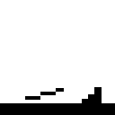
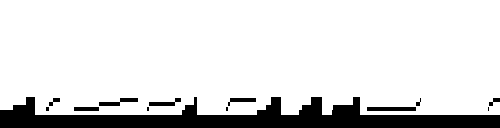

# py-image-markov-chain

This project implements a markov chain in Python that generates new real-looking text from input text.

This project also includes a method to apply markov chains to images and generate similar output images with any length. See [sample](#sample) for a demo. 

# Sample
Input (128x128px)

Output (128px x 500px)

